# An Expo based React Native mobile app

An implementation based on: https://www.uplabs.com/posts/e-book-reader-app

### Expo Link
https://expo.io/@awoyotoyin/book-reader

### Screenshots

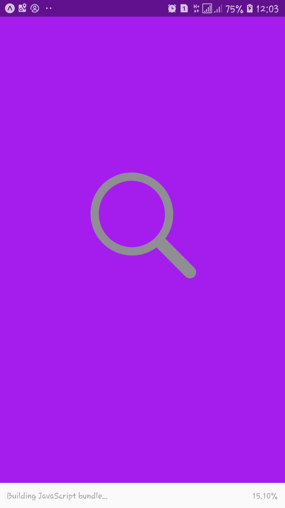
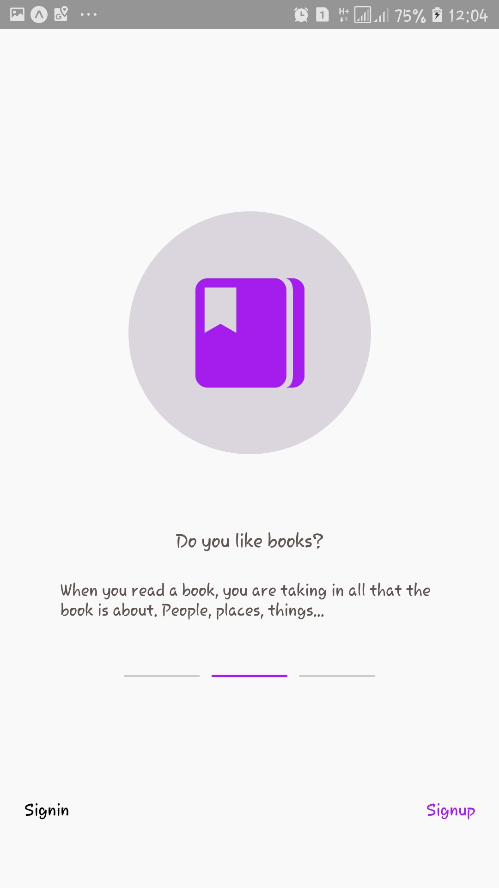
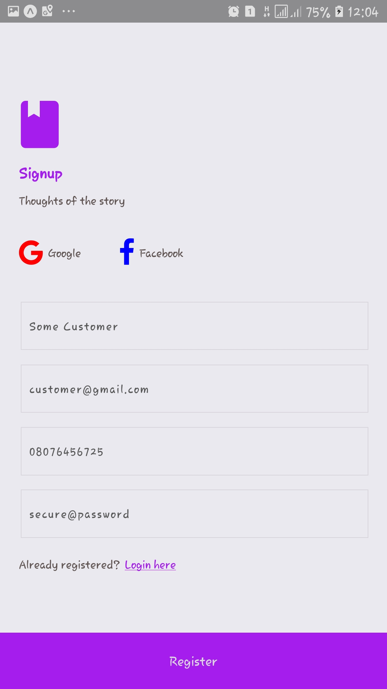
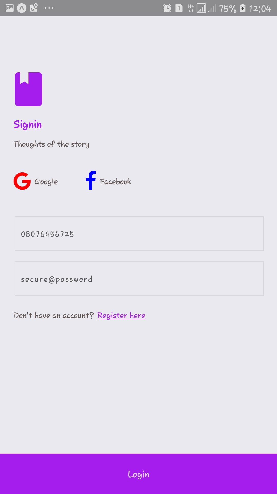
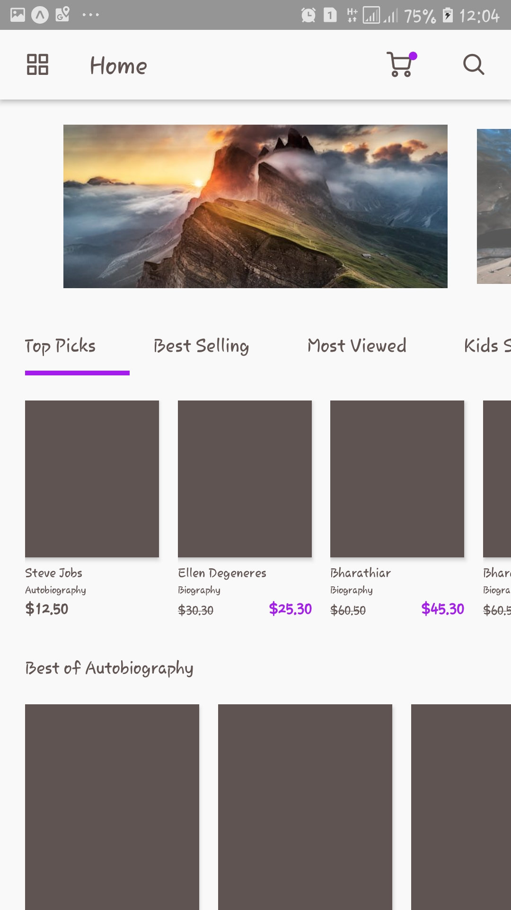
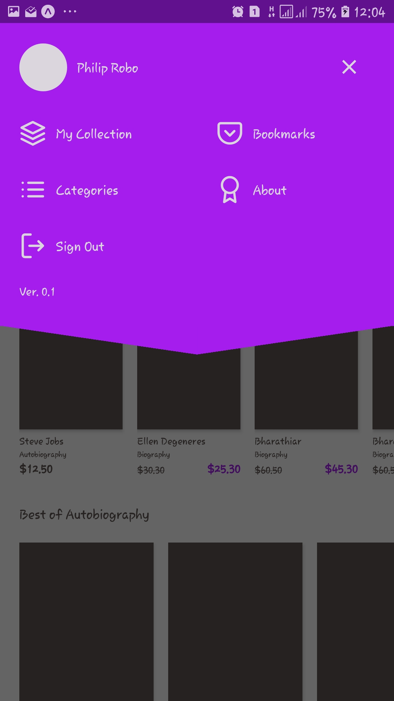
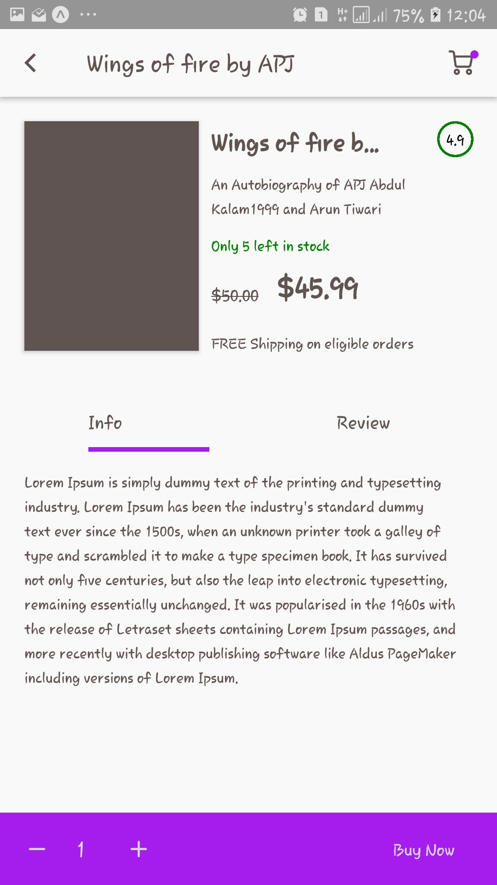
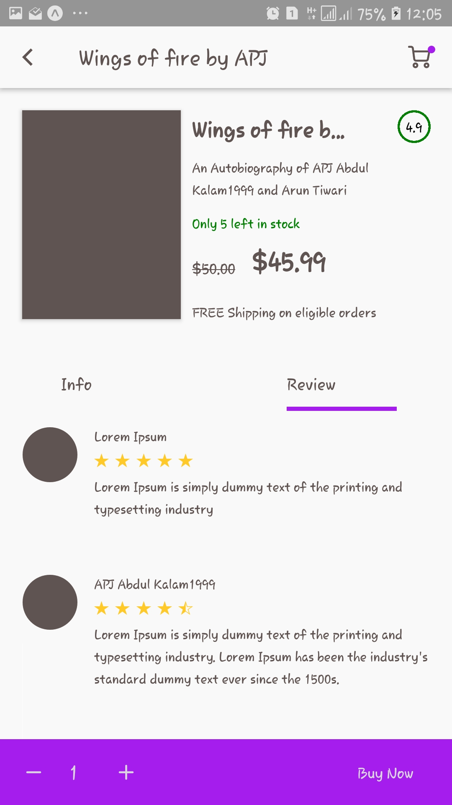
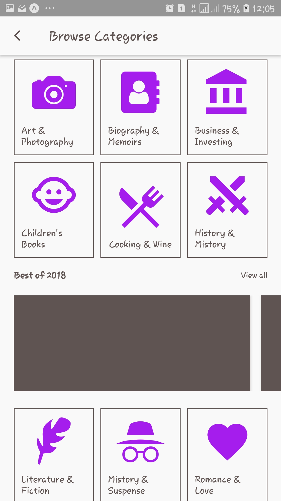
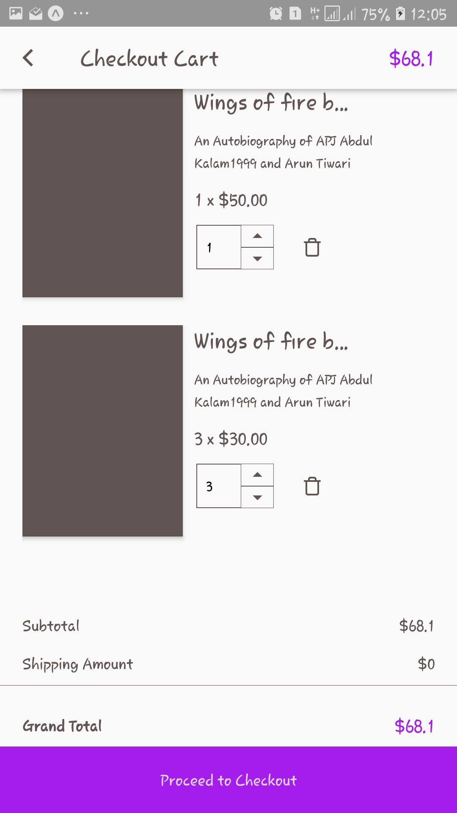
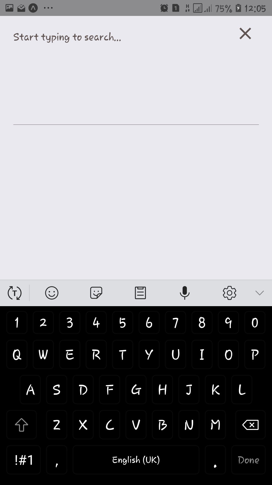

#### Roadmap

- [ ] Screens
    - [x] Onboarding - 100% done

    - [x] Authentication - 100% done
        - [x] Splash Screen 
        - [x] Welcome / On boarding Screen
        - [x] Register Screen
        - [x] Login Screen

    - [ ] Main App - 75% done
        - [x] Home Screen
        - [x] Drawer Navigation
        - [x] Categories Screen
        - [ ] Category Listing Screen
        - [x] Product Detail Screen
        - [x] Add Review Screen
        - [x] Checkout Cart Screen
        - [ ] Checkout Screen

- [ ] Logic (Considering GraphQL)  - 0% done
    - [ ] Authentication
        - [ ] Login
        - [ ] Register
